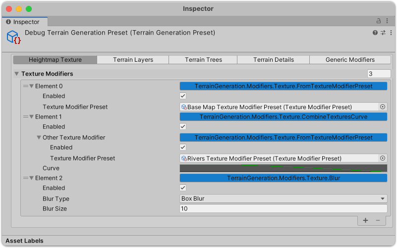
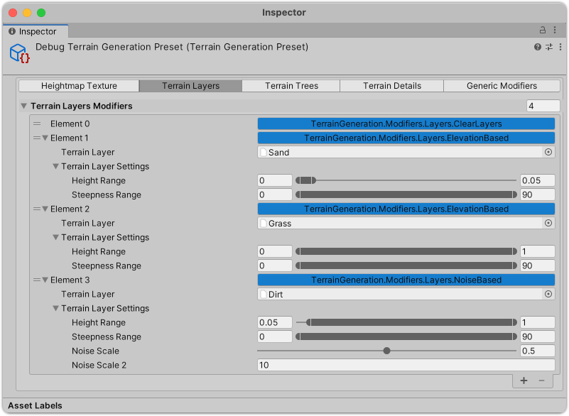
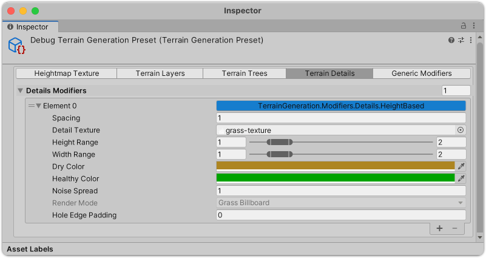
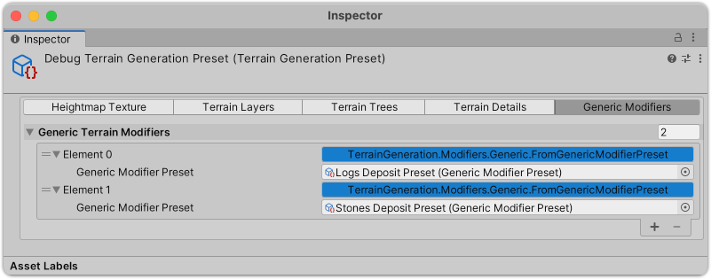
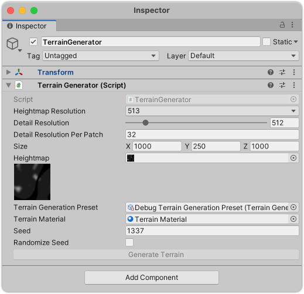

## Dependencies:

Automatically resolvable via OpenUPM:
* [NaughtyAttributes](https://openupm.com/packages/com.dbrizov.naughtyattributes/) `openupm add com.dbrizov.naughtyattributes`

Due to a [limitation](https://docs.unity3d.com/Manual/upm-git.html) by Unity on git dependencies, the following packages have to be manually added by adding each repository URL to your project's `manifest.json`:
* [FastNoise-Unity](https://github.com/shniqq/FastNoiseLite-Unity)
* [SerializeReferenceUI](https://github.com/shniqq/UnitySerializedReferenceUI)
* [RawTextureDataProcessing](https://github.com/shniqq/RawTextureDataProcessing)

## Usage:

Create an instance of the `TerrainGenerationPreset` scriptable object.
Add entries to the `Heightmap Texture`, `Terrain Layers`, `Terrain Trees`, `Terrain Details` and `Generic Modifiers` tabs by instantiating new interface implementations via the dropdown menu as shown below:

Some examples how this can look like below:

| Heightmap Texture                             | Terrain Layers                          | Terrain Details                           | Generic Modifiers                           |
|-----------------------------------------------|-----------------------------------------|-------------------------------------------|---------------------------------------------|
|  |  |  |  |

You can also extend the available modifiers by implementing the respective interfaces, e.g. `ITextureModifier`, `IFloatValueProvider`, etc.

Next, add the `TerrainGenerator` component to a GameObject in your scene and add your previously created `TerrainGenerationPreset` instance. Tweak the remaining parameters to your liking.

Then, either call the `GenerateTerrain` or `GenerateTerrainAsync` methods, or click the `Generate Terrain` button during play mode.

Depending on your paramters, this should result in something like this:

